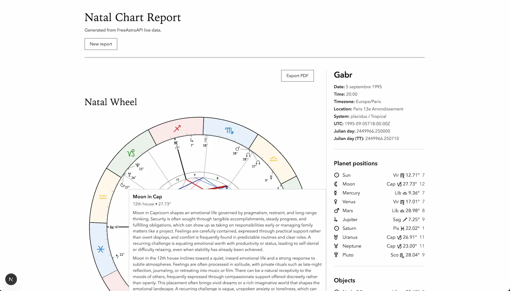
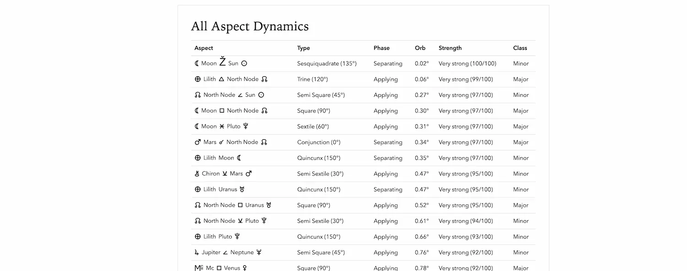

<div align="center">
  <h1>Open Chart</h1>
  <p>A production-ready natal chart and interpretation app built with Next.js.</p>
  <p>Powered by <a href="https://www.freeastroapi.com">FreeAstroAPI</a></p>
  <p><a href="https://open-chart.vercel.app">Live Demo: open-chart.vercel.app</a></p>
  <br/>
  <a href="https://vercel.com/new/clone?repository-url=https://github.com/GabrielRw/open-chart&env=FREE_ASTRO_API_KEY&envDescription=Your%20FreeAstroAPI%20key%20from%20freeastroapi.com">
    
  </a>
</div>

---

## Deploying to Vercel

Use the **Deploy with Vercel** button above to clone and deploy instantly.

During setup, add this required environment variable:

- `FREE_ASTRO_API_KEY` = your API key from [freeastroapi.com](https://www.freeastroapi.com)

The app proxies all upstream calls server-side, so the key never ships to the browser bundle.

## Overview

Open Chart is a minimalist, editorial-style natal report app with:

- City autocomplete and strict birth-data validation
- Live natal calculation from FreeAstroAPI
- SVG natal wheel rendering
- Structured report sections for ASC/MC, planets, aspects, and thematic interpretation
- Interactive chart behavior (hover insight, aspect selection, visual highlighting)

The stack is designed for production deployment with strict typing, runtime schema validation, and server-only API access.

## Product Preview

### Main report view



Minimalist white-background report interface with a large **Natal Wheel** on the left and a structured right rail showing identity/birth metadata (date, time, timezone, location, system, UTC, Julian values), followed by compact **Planet positions** and **Objects** tables. A contextual hover panel appears over the chart (example: *Moon in Capricorn*) with concise sign/house interpretation text, matching the app's editorial black/gray visual system with thin separators and no heavy card chrome.

### All Aspect Dynamics table



Tabular aspect analysis with columns for **Aspect**, **Type**, **Phase**, **Orb**, **Strength**, and **Class** (Major/Minor), designed for quick astrologer-grade scanning and comparison.

## Core Features

- Next.js App Router architecture
- TypeScript strict mode
- Tailwind CSS minimalist black/white design system
- React Hook Form + Zod input validation
- Route Handler proxies for geo search, natal calculation, and chart SVG
- Runtime response validation with Zod before render
- Aspect dynamics table with phase (Applying/Separating/Unknown)
- Right-side summary rail for quick chart data reference
- Unit tests for payload transforms, schemas, and formatters

## Tech Stack

- **Framework:** Next.js 14+ (App Router)
- **Language:** TypeScript (strict)
- **Styling:** Tailwind CSS
- **Forms:** React Hook Form + Zod
- **Validation:** Zod schemas for requests and responses
- **Testing:** Vitest
- **Linting/Formatting:** ESLint + Prettier

## API Integration

This app uses FreeAstroAPI docs contracts:

- Natal: `https://www.freeastroapi.com/docs/western/natal`
- Geo search: `https://www.freeastroapi.com/docs/geo/search`
- Chart SVG: `https://www.freeastroapi.com/docs/western/chart-svg`

Upstream base URL used in server code:

- `https://astro-api-1qnc.onrender.com/api/v1`

Authentication header sent server-side only:

- `x-api-key: FREE_ASTRO_API_KEY`

## Local Setup

### 1. Clone

```bash
git clone https://github.com/GabrielRw/open-chart.git
cd open-chart
```

### 2. Install

```bash
npm install
```

### 3. Configure environment

Create `.env.local`:

```env
FREE_ASTRO_API_KEY=your_freeastroapi_key_here
```

A template is included as `.env.example`.

### 4. Run development server

```bash
npm run dev
```

Open [http://localhost:3000](http://localhost:3000).

## Scripts

- `npm run dev` — start local development server
- `npm run build` — production build
- `npm run start` — run production server
- `npm run lint` — run ESLint
- `npm run test -- --run` — run unit tests once

## Route Handlers (Server Proxies)

- `GET /api/geo/search?q=...&limit=...`
  - Proxies upstream geo search
  - Normalizes city results
- `POST /api/natal/calculate`
  - Validates payload with Zod
  - Calls upstream natal endpoint (`include_minor=true`)
- `POST /api/natal/chart-svg`
  - Validates payload + chart config
  - Calls upstream experimental SVG endpoint

Error handling includes mapped responses for validation, auth, rate-limit, timeout, network, and upstream schema mismatch scenarios.

## Request Contract (Natal)

The app sends this natal structure (validated):

- Name (optional)
- Birth date/time fields (`year`, `month`, `day`, `hour`, `minute`)
- Location fields (`city`, `lat`, `lng`, `tz_str`)
- `house_system: "placidus"`
- `zodiac_type: "tropical"`
- `interpretation: { enable: true, style: "improved" }`
- `include_features: ["asc", "mc", "chiron", "lilith", "true_node", "mean_node"]`
- `include_speed: true`
- `include_dominants: true`

## SVG Chart Configuration

The chart request uses a tuned visual config with:

- light theme
- explicit ring and line widths
- per-aspect line colors (conjunction/opposition/trine/square/sextile/quincunx)
- enabled display points: planets + ASC + node + Lilith + Chiron

The response SVG is injected client-side and supports interaction behaviors implemented in the report view.

## Report Structure

The `/report` page renders:

- Natal wheel (SVG)
- 1st House / ASC section
- 10th House Cusp / MC section
- Planet interpretation blocks
- All Aspect Dynamics table
- Thematic interpretation sections
- Right-column reference rail (birth data, planet positions, objects, angles, houses, elements)

## Project Structure

- `app/page.tsx` — input flow
- `app/report/page.tsx` — report route
- `app/api/geo/search/route.ts` — geo proxy
- `app/api/natal/calculate/route.ts` — natal proxy
- `app/api/natal/chart-svg/route.ts` — SVG proxy
- `components/form/*` — input form modules
- `components/report/*` — report rendering and chart interactions
- `lib/api/freeastro.ts` — upstream API service layer
- `lib/schemas/astro.ts` — Zod schemas
- `lib/types/astro.ts` — strict TypeScript contracts
- `lib/formatters.ts` — display utilities
- `lib/errors.ts` — API error mapping

## Quality and Validation

Before deploying:

```bash
npm run lint
npm run test -- --run
npm run build
```

Expected outcome:

- lint clean
- tests passing
- successful production build

## Vercel Production Checklist

1. Import repository in Vercel
2. Add env var `FREE_ASTRO_API_KEY`
3. Deploy
4. Verify:
   - `/` form submits
   - city autocomplete returns results
   - `/report` renders interpretation and chart
   - API routes respond with expected status/error mapping

## Security Notes

- API key is server-only (`.env.local` / Vercel env)
- No direct client calls to upstream FreeAstroAPI
- All external calls are proxied via Next route handlers

## Contributing

PRs are welcome.

1. Create a branch
2. Make focused changes
3. Run lint/test/build locally
4. Open a PR with clear reproduction and expected behavior

## Credits

Astrology data powered by [FreeAstroAPI](https://www.freeastroapi.com).  
Built with Next.js, TypeScript, Tailwind CSS, React Hook Form, and Zod.
